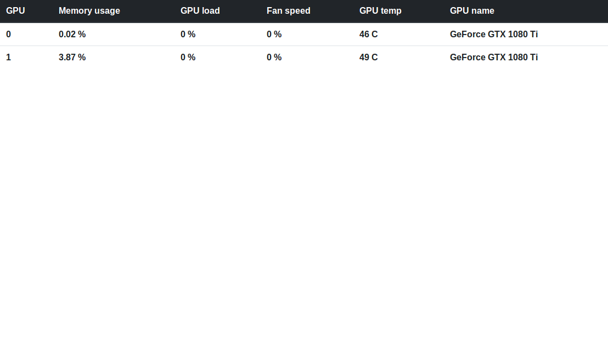

# GPUse

Using this simple utility we can see if the server is in use or not.
Please come with suggestions on what would be nice to have in this utility. 
Pull requests are welcome. 

Information available now: 

 - GPU, Memory usage, GPU load, Fan speed, GPU temp and GPU name

### Screenshot

